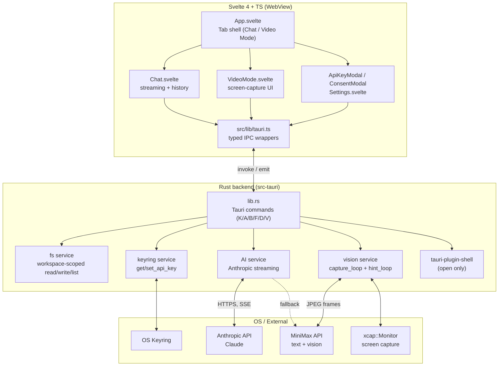

# Luna Agent — Architecture

## 1. What this is

`luna-agent` is a **desktop AI-coding assistant** built on Tauri 2 (Rust
backend, native window) + Svelte 4 (TypeScript frontend in WebView). It opens
a project folder, indexes code, runs AI chat with workspace context, and
(test feature) continuously watches the screen via vision model for proactive
hints. Distributed as a native binary for Windows / macOS / Linux.

**Stack:**
- Tauri `2.x` (Rust 2021, edition stable)
- Plugins: `shell`, `dialog`, `fs`, `stt` (vendored), `global-shortcut`,
  `clipboard-manager`
- Frontend: Svelte `4.x`, Vite `5.x`, TypeScript `5.x`
- Secrets: OS keyring via `keyring` crate (Windows Credential Manager /
  macOS Keychain / Linux Secret Service)
- AI: `reqwest` → Anthropic API (primary), MiniMax (text + vision)
- Logging: `tracing` + `tracing-subscriber`

## 2. High-level diagram



## 3. Tauri commands surface

Grouped by the letter prefixes used in `lib.rs`:

### `K` — Keyring (secrets)

| Command | Purpose |
|---|---|
| `get_api_key(provider)` | Read key for provider (`anthropic` / `minimax`) from OS keyring |
| `set_api_key(provider, key)` | Write key to OS keyring (overwrite) |

### `A` — Workspace management

| Command | Purpose |
|---|---|
| `open_workspace(path)` | Set current workspace, validate exists, is a directory |
| `pick_workspace()` | Show native folder picker, then `open_workspace` |
| `current_workspace()` | Return the currently opened workspace path |

### `B` — File operations (workspace-scoped)

| Command | Purpose |
|---|---|
| `read_file(path)` | Read file inside current workspace; reject if outside |
| `edit_file(path, old, new)` | Atomic edit: verify `old` matches exactly, replace, return diff |
| `list_dir(path, depth)` | Recursive directory listing, respects `.gitignore` via `ignore` crate |

### `F` — Dev server / Preview

| Command | Purpose |
|---|---|
| `start_dev_server(project, port?)` | Start `npm run dev` (or static fallback), capture output |
| `open_preview_window(url, title?)` | Open URL in a new `preview-*` Tauri window |

### `D` — AI chat

| Command | Purpose |
|---|---|
| `ai_chat_stream(req)` | Anthropic streaming chat; returns SSE chunks via Tauri events |

### `V` — Video mode (test feature)

| Command | Purpose |
|---|---|
| `list_monitors()` | List available screens (xcap) |
| `start_screen_capture({monitor_id, fps, max_width})` | Start capture+hint loop |
| `stop_screen_capture()` | Stop both loops, clear in-memory buffer |
| `capture_single_frame({...})` | One-shot capture (no LLM call) |
| `get_latest_frame()` | Last frame from in-memory buffer |
| `set_active_goal(goal)` | Tell vision what to look for |
| `call_minimax_vision({system, user_text, image_base64, max_tokens?})` | MiniMax-M3 vision call |

### Legacy

| Command | Purpose |
|---|---|
| `call_minimax(messages)` | MiniMax text-only chat (legacy path) |
| `search_news(query, n)` | DuckDuckGo news search (legacy) |
| `open_url(url)` | System `open` (legacy wrapper) |

### `T` — Background agent (Phase M0–M5, Cursor Composer mode)

See `docs/adr/0011-background-agent.md` for the full design.
Decoupled, persistent tasks that run their own M3 supervisor loop
concurrently with the chat. Sub-agents (M2.7-highspeed) are
dispatched via the `dispatch_subagent` tool (Phase M2).

| Command | Returns | Notes |
|---|---|---|
| `task_create` | `String` (new id) | Auto-spawns the runner |
| `task_list` | `Vec<TaskSummary>` | Optional status filter |
| `task_get` | `Task` | Full record |
| `task_delete` | `()` | Cancels if running |
| `task_cancel` | `()` | Idempotent |
| `task_result` | `Option<String>` (markdown) | `None` until terminal |
| `task_steps` | `Vec<TaskStep>` | Full event log |

Live events:

- `task_progress` — per-step event (rate-limited to 30 Hz for
  text; tool/sub-agent/cost events unconditional)
- `task_finished` — terminal status notification (consumed by
  `App.svelte::onTaskFinished` for desktop notifications)

## 4. Tauri capabilities (`capabilities/default.json`)

Active permission grants for the `default` capability (windows: `main`,
`preview-*`):

- `core:default` + sub-permissions: `event`, `window`, `webview`, `app`, `path`
- `shell:allow-open` (open URLs only — no arbitrary command exec)
- `dialog:default` (native file/folder pickers)
- `fs:default` (file ops; gated by `workspace_root` in Rust, NOT by Tauri)
- `stt:default` + `stt:allow-list-models`, `stt:allow-install-model`,
  `stt:allow-set-active-model`, `stt:allow-unload-model`,
  `stt:allow-start-listening`, `stt:allow-stop-listening`
- `global-shortcut:default` + register/unregister/is-registered
- `clipboard-manager:default`

**Notably NOT granted:**
- `shell:allow-execute` (no arbitrary command exec)
- `fs:write` outside workspace (Rust enforces)
- Network egress (reqwest from Rust, not WebView → no CORS concerns)

## 5. AI providers

| Provider | Status | Key | Use case |
|---|---|---|---|
| Anthropic (`claude-sonnet-4.5`) | **Primary** | `ANTHROPIC_API_KEY` | `ai_chat_stream` — general chat |
| MiniMax (`MiniMax-Text-01`) | Secondary | `MINIMAX_API_KEY` | `call_minimax` — text legacy |
| MiniMax (`MiniMax-M3`) | Test feature | `MINIMAX_API_KEY` | `call_minimax_vision` — Video Mode |

**Decision policy:** see [ADR-0002](./adr/0002-ai-provider-default-anthropic.md).
**Fallback strategy:** no automatic provider failover yet. If Anthropic 4xx/5xx,
UI shows error and lets user switch provider in Settings.

## 6. Security boundaries

See [`docs/security-model.md`](./security-model.md) for the full threat model.
TL;DR: API keys in OS keyring, no `csp: null` long-term (debt tracked),
workspace-scoped FS, allow-listed shell, no remote code execution.

## 7. Build & distribution

- **Dev:** `npm run tauri:dev` (Vite + Tauri, hot reload)
- **Release:** `npm run tauri:build` → produces `.msi`/`.nsis` (Win),
  `.dmg` (macOS), `.deb`/`.AppImage` (Linux)
- **CI:** `.github/workflows/build.yml` (matrix build)
- **Doc lint:** `.github/workflows/docs-lint.yml` (checks AGENTS.md, docs, ADR)

## 8. Architectural decision index

Full ADR list in [`docs/adr/README.md`](./adr/README.md). Current high-impact
decisions:

- [ADR-0001](./adr/0001-use-madr-for-adrs.md) — Use MADR 4.0 for ADRs
- [ADR-0002](./adr/0002-ai-provider-default-anthropic.md) — Anthropic Claude Sonnet 4.5 as primary
- [ADR-0003](./adr/0003-embedding-model-bge-small.md) — `bge-small-en-v1.5` for embeddings (planned)
- [ADR-0004](./adr/0004-vector-store-lancedb.md) — LanceDB embedded for vectors (planned)
- [ADR-0005](./adr/0005-frontend-stack-svelte.md) — Svelte 4 + TS for UI
- [ADR-0006](./adr/0006-tauri-2-as-shell.md) — Tauri 2 as the desktop shell

## 9. Known architectural debt

Tracked in [`docs/state.md`](./state.md) under "Architecture debt" — kept
short on purpose, full retrospectives in ADR when they're closed out.

## 10. Self-evolution (E0–E4)

Luna can read and modify its own source code under direct human
supervision. The full design lives in
[`adr/0010-self-evolution.md`](./adr/0010-self-evolution.md). This
section is the bird's-eye view.

### Closed loop

```
User clicks "Run self-diagnosis" in the 🧬 Self tab
  → self_inspect()       (E0: metadata, git sha, file count)
  → self_diagnose()      (E2: static scan + optional LLM review)
  → user picks issues
  → self_plan()          (E2: LLM composes minimal edit_file steps)
  → user clicks "Try in sandbox"
  → sandbox_create()     (E3: copy source to %TEMP%/luna-sandbox/...)
  → sandbox_apply()      (E3: apply plan to the copy)
  → sandbox_run()        (E3: cargo build --release, cargo test, --smoke)
  → sandbox_collect()    (E3: full report: steps, commands, smoke)
  → user reviews the report
  → apply_self_update()  (E4: pre-update snapshot, apply to prod, rebuild, smoke, atomic swap)
  → restart Luna to load the new binary
```

If anything breaks, the user can pick any prior snapshot and
`rollback_self_update` (mandatory feedback, atomic swap back).

### Service layer

All under `src-tauri/src/services/evolver/`:

- `inspect.rs` — metadata (E0)
- `snapshot.rs` — full source copies, GC, important flag (E1)
- `diagnose.rs` — Issue, static_scan, llm_analyze (E2)
- `planner.rs` — Plan, PlanStep, build with LLM (E2)
- `protected.rs` — list of files the worker MUST NOT touch (E2+)
- `worker.rs` — Worker struct, apply_step / apply_plan (E3+)
- `sandbox.rs` — temp-dir copy, sandbox e2e, smoke (E3)
- `updater.rs` — build + smoke + atomic swap (E4)
- `feedback.rs` — feedback persistence + digest for next diagnose (E4)
- `prompts/` — system prompts for diagnose + plan (E2)

### Security boundary

- The worker MUST NOT modify: `Cargo.toml`, `tauri.conf.json`,
  `package.json`, `capabilities/default.json`, `LICENSE*`, `vendor/**`,
  `AGENTS.md`, `README.md`, anything under `target/`, `node_modules/`,
  `dist/`, `.luna/`.
- The planner pre-filters steps that violate this; the worker
  double-checks on apply.
- The worker uses the standard `ShellAllowList` — no new commands
  were needed.
- `--smoke` mode in `main.rs` runs a 25-second probe (init + sleep +
  exit 0) without starting the full Tauri app, so it's safe in any
  environment.

### Storage

```
%LOCALAPPDATA%\com.luna.agent\evolver\
├── active.json                  # { version, git_sha, build_ts, snapshot_id }
├── snapshots/                   # full source copies
├── feedback/                    # user feedback (open entries are injected into next diagnose)
└── (more in ADR-0010)

%TEMP%\luna-sandbox\            # active sandboxes; GC'd on startup + on discard
└── <sb-uuid>/
```

## 11. Personas (Phase P — see `adr/0012-personas.md`)

A persona is a **named, config-driven agent** that runs on the
same `supervisor::run_loop` as the anonymous code supervisor, but
with a custom system prompt, a curated tool whitelist, and a
per-mode model choice. v1 ships one persona: **Raziel** (keeper of
memory + Fusion News researcher).

### Files

```
src-tauri/src/services/agent/
  personas/
    mod.rs                  # types: AgentPersona, PersonaMode, PersonaTrigger
    registry.rs             # PersonaRegistry: load + hot-reload + lookup
    raziel.toml             # config: model_per_mode, allowed_tools, budget
    prompts/raziel_system.md   # system prompt (memory + fusion_news tails)
  persona_tools.rs          # 15 tool definitions + execution context
```

### Spawn flow

```
UI: persona switcher → "🜂 Raziel — memory"
 → invoke('raziel_chat', { message, mode: 'memory' })
 → lib.rs::raziel_chat:
     registry.get('raziel') → AgentPersona
     registry.read_system_prompt('raziel') → string
     registry.model_for('raziel', Memory) → 'M2.7-highspeed'
     Task::new(..., persona_id: Some('raziel'), ...)
     TaskManager::create(task, runner_closure)
 → TaskRunner::spawn → supervisor::run_loop(
     system_prompt = raziel_system.md,
     tools = supervisor_tools_for(persona.allowed_tools),  // 15 tools
     persona_ctx = Some(PersonaToolContext { memory, user_interests }),
     payload_sink = Some(PersonaPayloadSink::new()),
 )
```

### Persona tools

Raziel's 15 tools live in `persona_tools.rs` and are dispatched
inside `supervisor::execute_tool` (single `is_persona_tool(name)`
check). They cover memory CRUD (10), web/news (3), user interests
(1), and a special `produce_fusion_payload` that writes a
structured `Vec<FusionNewsItem>` into the `PersonaPayloadSink`.

### Fusion News payload

When Raziel runs in `fusion_news` mode and calls
`produce_fusion_payload`, the structured result is:
1. Returned from `supervisor::run_loop` as
   `SupervisorResult::persona_payload`.
2. Copied by the runner into `TaskResult::persona_payload` AND
   written to `<task_dir>/persona_payload.json` on disk.
3. Read by the UI (which subscribes to `task_finished` and calls
   `task_result`) to render Fusion News cards without parsing
   markdown.

### Adding a new persona

Drop a new `*.toml` + a matching `prompts/<id>_system.md` into
`services/agent/personas/`, then call `persona_reload` (or restart
the app). The registry validates the TOML against `VALID_TOOLS`
and the on-disk system prompt file at load time.

---


---

*This document is a **snapshot**, not a history. For change history, see
`CHANGELOG.md` and the ADR index. If you change architecture, update this
file in the same PR.*
