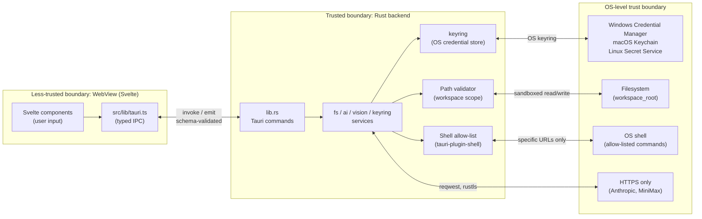

# Security model

> **Audience:** anyone changing `src-tauri/`, `capabilities/default.json`,
> `tauri.conf.json`, or anything that handles user secrets, file paths,
> or shell commands. If that's you, read this first.

This document describes the **trust boundaries** in Luna Agent: what the
WebView can do, what the Rust backend can do, what the OS keyring holds,
and where the known weak spots are. It is intentionally short — for
implementation details, follow the links.

## 1. Trust boundaries



**The single most important rule:** the WebView is **less trusted** than
the Rust backend. The Rust backend re-validates every Tauri command
argument, especially paths and shell calls. Never trust a value just
because it came from the WebView.

## 2. Tauri capability grants (current state)

`src-tauri/capabilities/default.json` is the **only** file that grants
permissions to WebView. Windows in scope: `main`, `preview-*`.

**Granted:**

| Plugin | Permission | Why |
|---|---|---|
| `core:default` | event, window, webview, app, path | Tauri basics |
| `shell:allow-open` | Open URLs / files via OS | Read browser links from chat, etc. |
| `dialog:default` | Native file/folder pickers | `pick_workspace` |
| `fs:default` | File ops | Frontend-side helpers; gated again in Rust |
| `stt:default` + sub-perms | Speech-to-text model lifecycle | `tauri-plugin-stt` |
| `global-shortcut:default` | System-wide hotkey | Quick chat toggle |
| `clipboard-manager:default` | Clipboard read/write | Chat paste / image attach |

**Explicitly NOT granted:**

| Plugin | Permission | Why not |
|---|---|---|
| `shell:allow-execute` | Run arbitrary commands | Too dangerous; we don't need it |
| `shell:allow-spawn` | Spawn child processes | Same; out of scope for MVP |
| `fs:allow-remove` (broad) | Delete any file | Risk of accidental `dist` deletion |
| `fs:write` outside workspace | Write anywhere | Enforced in Rust, not via Tauri scope |
| `http:default` | Egress from WebView | Network calls go through Rust `reqwest` |

**Note (debt, see `docs/state.md` D-2):** `fs:default` is broader than
we'd like — it grants the WebView the ability to read any file the
OS-level Tauri process can read. The Rust `fs` service re-checks
that every path is inside the active `workspace_root`, but if a bug
in the Rust service is found, the WebView has a fallback capability.
**Action:** replace `fs:default` with explicit `fs:allow-read-file`
+ scoped scope in a follow-up ADR.

## 3. Secrets handling

| Secret | Storage | Read path | Write path |
|---|---|---|---|
| Anthropic API key | OS keyring | `get_api_key("anthropic")` (Rust → keyring) | `set_api_key("anthropic", k)` |
| MiniMax API key | OS keyring | `get_api_key("minimax")` | `set_api_key("minimax", k)` |
| Env fallback | Process env | Read once at startup if keyring is empty | Never written |

**Rules:**

- API keys **never** appear in:
  - Source code (CI grep'd via `AGENTS.md` § 4)
  - Log output (the `tracing-subscriber` env filter never enables
    `services::ai::debug` in release)
  - The WebView's DevTools (IPC payload includes only the user's
    own settings, never the key)
- `keyring` crate uses:
  - **Windows:** Credential Manager (`windows-native` feature)
  - **macOS:** Keychain (`apple-native` feature)
  - **Linux:** Secret Service via `dbus` (`sync-secret-service`)
- Keys are read on-demand, never cached in process memory longer
  than the lifetime of the HTTP request.
- The `set_api_key` command **overwrites** the existing entry — no
  history is kept. This is intentional (we don't want old keys
  lingering).

## 4. Filesystem boundary

The `fs` service in `src-tauri/src/lib.rs` (`B` group) is the **only**
way the WebView reads, edits, or lists files. Every command:

1. Receives a path argument from the WebView.
2. Resolves the path to an absolute path via `Path::canonicalize` (or
   `Path::join` for new files).
3. Checks that the resolved path is **inside** `workspace_root`
   (lexical containment check, with `..` rejection).
4. If the path escapes `workspace_root`, returns an error and logs
   the attempt at `warn!` level.

**Allowed operations:**

- `read_file(path)` — read text/binary file (binary is base64 in the
  IPC payload).
- `edit_file(path, old, new)` — atomic find-and-replace with a
  pre-check that `old` matches the file's current content at the
  target line range. Rejects if mismatch (no fuzzy merge).
- `list_dir(path, depth)` — recursive listing, respects `.gitignore`
  via the `ignore` crate, capped at `depth` (default 3, max 10).

**Not yet exposed (deferred to phase 3):**

- `create_file(path, content)` — for tool protocol, will require
  user-confirm dialog.
- `delete_file(path)` — never via IPC without explicit human confirm.

## 5. Shell boundary

Currently the WebView can **only** call `shell:allow-open`, which
launches the OS's default handler for a URL or file. This is a
**deliberately small surface** — no `shell:allow-execute`, no
`shell:allow-spawn`.

**Phase 3 will add `run_command`** as part of the agent tool
protocol (`docs/tool-protocol.md`). When that lands, it will:

- Be a Rust-side command (not a Tauri permission grant).
- Use an allow-list of commands, not arbitrary strings:
  - `cargo test`, `cargo build`, `cargo check`, `cargo clippy`
  - `npm test`, `npm run build`, `npm run lint`
  - `pytest`, `python -m unittest`
  - `go test`
  - `make <target>` (if `Makefile` is in workspace root)
- Capture stdout / stderr / exit code.
- Have a per-command timeout (default 30 s, max 5 min).
- Have a "dry-run" mode that prints the command without executing.
- Be opt-in via Settings (off by default for non-yolo mode).

**Why no broader shell today:** the Tauri docs note that arbitrary
shell exec is the #1 source of CVEs in Tauri apps. We don't need
it; we add it back behind a hard allow-list in phase 3.

## 6. Network boundary

- All HTTP egress is from Rust via `reqwest` (not from WebView).
- `rustls` is forced (no `native-tls`); see `reqwest` features in
  `Cargo.toml`.
- Only the configured AI providers are contacted:
  - `https://api.anthropic.com`
  - `https://api.minimax.chat` (or whatever the current endpoint is)
- No telemetry, no analytics, no auto-update pings (until a separate
  ADR enables them).
- WebView cannot make arbitrary HTTP calls (`http:default` not in
  the capability file).

## 7. CSP (Content Security Policy)

`tauri.conf.json` currently has `"csp": null`. **This is a known
debt** (D-1 in `docs/state.md`).

**Why it's a debt:** with no CSP, the WebView will execute any
inline script that gets into the DOM. If the chat ever renders
untrusted content (e.g., a `tool_use` result with HTML), an
attacker who controls the input can inject a script that calls
`invoke()` — and the WebView has all the capabilities we granted
in § 2.

**Plan to fix:**

1. Switch to a strict CSP in dev:
   ```
   default-src 'self';
   script-src 'self';
   style-src 'self' 'unsafe-inline';
   img-src 'self' data:;
   connect-src 'self' https://api.anthropic.com https://api.minimax.chat;
   font-src 'self' data:;
   object-src 'none';
   base-uri 'self';
   form-action 'none';
   frame-ancestors 'none';
   ```
2. Verify all Svelte components and Tauri events still work.
3. Land an ADR explaining the final CSP and the threat model
   (which injections we still accept and why).

**No release with `csp: null` should reach a non-dev user.**

## 8. Threat model — quick reference

| Threat | Mitigation |
|---|---|
| Attacker injects HTML into chat (XSS) | CSP will block inline scripts; until then, don't render untrusted HTML in Svelte (`{@html ...}` is forbidden) |
| Stolen API key from disk | Never on disk; OS keyring only |
| Stolen API key from logs | `tracing` filter excludes `services::ai::debug` in release |
| Path traversal via WebView | `fs` service lexical containment check |
| Arbitrary command exec | `shell:allow-execute` not granted; future `run_command` uses allow-list |
| Egress to non-AI hosts | `reqwest` is the only egress; URLs are hard-coded constants in services |
| Man-in-the-middle on AI calls | `rustls`; we accept the CA trust store of the OS |
| Workspace mix-up (read file A from project B) | `open_workspace` sets a single `workspace_root` per app instance |
| `.env` files in indexed code | `.luna/index/.gitignore` is the start; explicit filter in indexer to skip `.env*` |
| Vendored patch (`tauri-plugin-stt`) | Documented in `Cargo.toml`; future ADRs must justify removing it |
| A rogue AI agent (in phase 3) | Dry-run mode, user-confirm dialog per file write, yolo-mode off by default |

## 9. Reporting a security issue

- **Not** via public GitHub issues.
- Use GitHub's private vulnerability reporting
  (`/.github/SECURITY.md` once the repo is public).
- For now (pre-public): direct message to the repo owner.

## 10. Self-evolution threat model (E0–E4)

Luna Agent can read and modify its own source code via the
self-evolution subsystem (`src-tauri/src/services/evolver/`). The full
design is in
[`adr/0010-self-evolution.md`](./adr/0010-self-evolution.md). This
section covers the threat model.

### What's at stake

A self-modifying app breaks the usual "code is immutable at runtime"
assumption. If the LLM produces a malicious or buggy plan, it could:

- **Persist a backdoor** in Luna's own source code (and since Luna
  rebuilds and swaps itself, this backdoor would survive the next
  run).
- **Exfiltrate secrets** by including an `edit_file` that calls
  `keyring::get_password` and writes the result to a temp file.
- **Disable safety features** by removing CSP, capability grants, or
  CSP-allowing the WebView to run arbitrary code.
- **Self-update without user consent** if the apply path skips the
  "needs_restart" prompt or runs atomically without confirmation.

### Mitigations (defense in depth)

1. **Manual trigger only.** Self-evolution is *only* started by a
   user click. There is no scheduler, no event hook, no remote
   command. The user has to be in front of the app.
2. **Sandbox-first.** Plans are applied to a copy in
   `%TEMP%/luna-sandbox/<id>/`, never the production tree. Only when
   the user reviews the sandbox report and clicks "Apply" does the
   plan touch the real source.
3. **Pre-update snapshot.** `apply_self_update` always creates a
   `pre-update-<short>` snapshot first. The user can roll back to it
   at any time.
4. **Protected files.** `protected::is_protected_path` rejects any
   step that touches `Cargo.toml`, `tauri.conf.json`,
   `package.json`, `capabilities/default.json`, `LICENSE*`,
   `vendor/**`, `AGENTS.md`, `README.md`, or anything under `target/`,
   `node_modules/`, `dist/`, `.luna/`. The planner pre-filters; the
   worker double-checks.
5. **Hard-coded shell allow-list.** The worker uses
   `services::shell::ShellAllowList` — no `git push`, no `curl`, no
   `powershell -Command`, no arbitrary command exec.
6. **Smoke test required.** A new binary must pass `--smoke` (a
   25-second probe that exits 0 if init is healthy). No smoke = no
   swap.
7. **Rollback with mandatory feedback.** `rollback_self_update`
   requires a feedback message ≥ 5 characters, which is persisted
   and injected into the next diagnose. The user always records
   *why* they rolled back.
8. **No auto-restart.** After a successful `apply`, the new binary
   lives at `<exe>` but the running process still holds the old
   one (Windows). The user must explicitly restart.
9. **No network exfil from the LLM call.** `reqwest` is the only
   egress; URLs are hard-coded to `https://api.anthropic.com`.
10. **API keys never logged.** `tracing-subscriber` filters exclude
    `services::evolver::*request*` and full LLM prompts are not
    logged.
11. **GC of orphans.** `cleanup_orphans()` runs in the `setup`
    hook on startup, removing stale `%TEMP%/luna-sandbox/<id>/`
    directories from a previous crash.

### Residual risks

- A subtle LLM-produced edit that *appears* safe (e.g. a one-line
  change to an obscure file) but introduces a bug. Mitigated by
  the sandbox full e2e + the user diff-reviewing the plan before
  "Apply".
- A user who blindly clicks "Apply" without reading. Mitigated by
  the risk_score badge (green < 0.3, yellow 0.3–0.7, red ≥ 0.7)
  and the explicit `confirm()` dialog at the apply step.
- Compromise of the Anthropic API key. Mitigated by the key being
  in the OS keyring (not on disk) and the keyring entry being scoped
  to `KEYRING_SERVICE` (= "luna-agent").

### Out of scope (v1)

- Signed binaries (no `tauri-build` support yet; tracked in E5+).
- Auto-update server (no remote update channel).
- Auto-commit on apply (user commits manually).
- `expected_swap_exe` recovery for blocked atomic swaps (out of v1;
  currently the user must re-attempt the swap manually).

---

*This document is updated every time the capability file changes, a new
Tauri command is added, or the threat model shifts. Changes are tracked
in `CHANGELOG.md` and the ADR index.*
