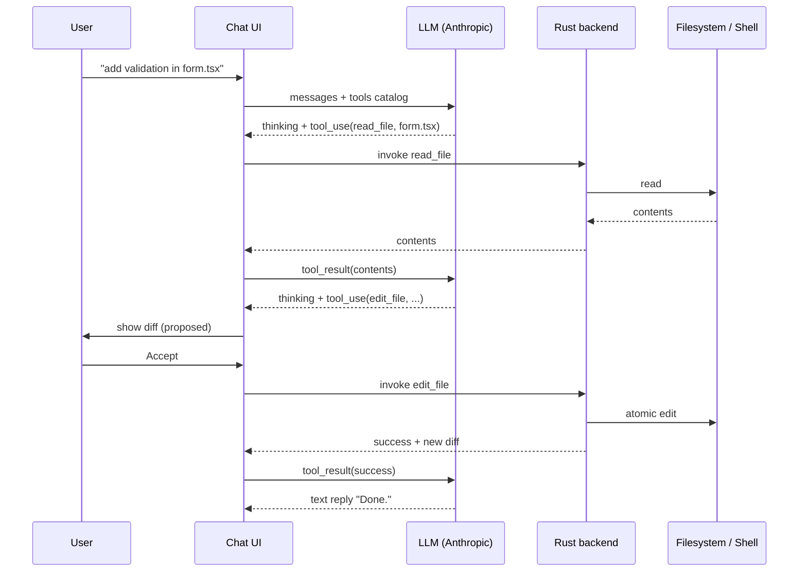

# Tool protocol — JSON-Schema for agent tools

> **Status:** RFC. The tools described here are the **target** for
> phase 3 (agent loop + apply/diff). Phase 1 exposes a subset
> (file read/write) directly as Tauri commands without going through
> the agent loop.
>
> This document is normative for phase 3. If you're implementing
> phase 1 file ops, the Tauri commands in `src-tauri/src/lib.rs` (`B`
> group) are the current truth.

## 1. Goals

When Luna Agent's chat can call **tools** (read a file, run a test,
apply a diff), the protocol must:

- Be **vendor-neutral** — work with Anthropic tool-use, OpenAI
  function-calling, and any future provider that exposes a tools API.
- Be **strictly typed** — every tool has a JSON-Schema for its input
  and output. No free-form `args` blobs.
- Be **safely invokable** — every tool call goes through the Rust
  backend's safety boundary (workspace scope, allow-list for shell,
  confirm dialog for destructive ops).
- Be **diff-able** — the AI's intended edit is presented to the user
  as a unified diff before any file is touched.
- Be **cancellable** — long-running tools (test runs, indexing) can
  be aborted from the UI.

## 2. Wire-level format (Anthropic-flavored)

The protocol is a thin adapter on top of **Anthropic tool-use**,
which is the most explicit of the three (Anthropic, OpenAI, OpenRouter).
A `Tool` is:

```typescript
type Tool = {
  name: string;            // unique, kebab-case
  description: string;     // for the LLM; "what this tool does"
  input_schema: JsonSchema; // strict JSON-Schema 2020-12
};
```

A `ToolUseBlock` (in the LLM's response) is:

```typescript
type ToolUseBlock = {
  type: "tool_use";
  id: string;              // unique per turn, used for the result block
  name: string;            // must match a registered tool
  input: unknown;          // validated against the tool's input_schema
};
```

The result is sent back as a `ToolResultBlock`:

```typescript
type ToolResultBlock = {
  type: "tool_result";
  tool_use_id: string;     // matches a prior ToolUseBlock.id
  content: string | ContentBlock[];  // for the LLM
  is_error?: boolean;
};
```

## 3. Core tool catalog (phase 3 target)

### 3.1 `read_file`

Read a file from the current workspace.

```json
{
  "name": "read_file",
  "description": "Read the contents of a file inside the open workspace. Use this before editing or when answering questions about specific files.",
  "input_schema": {
    "type": "object",
    "properties": {
      "path": {
        "type": "string",
        "description": "Workspace-relative path, e.g. 'src/lib/foo.ts'."
      },
      "offset": {
        "type": "integer",
        "minimum": 0,
        "description": "Line offset to start reading from (0-indexed). Omit to read from the start."
      },
      "limit": {
        "type": "integer",
        "minimum": 1,
        "maximum": 2000,
        "description": "Maximum number of lines to read. Default 500."
      }
    },
    "required": ["path"],
    "additionalProperties": false
  }
}
```

**Result:**

```typescript
{
  content: string;         // file contents (UTF-8, may be truncated)
  total_lines: number;     // total lines in the file
  truncated: boolean;      // true if the result hit the limit
  sha256: string;          // for edit_file pre-check
}
```

**Safety:** path is canonicalized and checked against `workspace_root`.
Binary files return `{ error: "binary file" }` and a base64 preview.

### 3.2 `edit_file`

Apply an atomic edit to a single file.

```json
{
  "name": "edit_file",
  "description": "Replace an exact string in a file with a new string. The old string must match the current file content exactly. Use read_file first to see the exact whitespace.",
  "input_schema": {
    "type": "object",
    "properties": {
      "path": { "type": "string" },
      "old_text": {
        "type": "string",
        "description": "Exact text to replace. Must appear verbatim in the file."
      },
      "new_text": {
        "type": "string",
        "description": "Replacement text. Empty string deletes the occurrence."
      }
    },
    "required": ["path", "old_text", "new_text"],
    "additionalProperties": false
  }
}
```

**Result:**

```typescript
{
  diff: string;            // unified diff of the change
  applied: boolean;        // false if the user hasn't accepted yet
  sha256: string;          // new file hash
}
```

**Safety:**

- `old_text` must match exactly (after trimming trailing whitespace
  per file). If it doesn't match or matches in multiple places, the
  tool returns `{ is_error: true, content: "old_text not found uniquely" }`.
- The edit is **proposed** in the UI with a diff; the user clicks
  **Accept** before it's applied. Yolo mode (off by default) skips
  this.
- Path must be inside `workspace_root` (enforced in Rust).

### 3.3 `search_code`

Find files / lines matching a query.

```json
{
  "name": "search_code",
  "description": "Search the workspace for code matching a regex. Returns file paths and line ranges.",
  "input_schema": {
    "type": "object",
    "properties": {
      "query": { "type": "string", "description": "Regex or ripgrep pattern." },
      "glob": { "type": "string", "description": "Optional glob to scope the search, e.g. '**/*.ts'." },
      "max_results": { "type": "integer", "minimum": 1, "maximum": 200, "default": 50 }
    },
    "required": ["query"],
    "additionalProperties": false
  }
}
```

**Result:**

```typescript
{
  matches: Array<{
    path: string;
    line: number;          // 1-indexed
    column: number;        // 0-indexed
    preview: string;       // up to 200 chars
  }>;
}
```

**Safety:** no path escaping; results are workspace-scoped.

### 3.4 `list_dir`

List directory contents, respecting `.gitignore`.

```json
{
  "name": "list_dir",
  "description": "List files and subdirectories inside the workspace.",
  "input_schema": {
    "type": "object",
    "properties": {
      "path": { "type": "string", "default": "." },
      "depth": { "type": "integer", "minimum": 0, "maximum": 10, "default": 3 }
    },
    "additionalProperties": false
  }
}
```

**Result:**

```typescript
{
  entries: Array<{
    path: string;
    kind: "file" | "dir";
    size?: number;         // bytes, for files
  }>;
}
```

### 3.5 `run_command` (allow-listed)

Run a command from the workspace's allow-list.

```json
{
  "name": "run_command",
  "description": "Run a build, test, or lint command. The command must be in the workspace's allow-list (e.g. 'npm test', 'cargo test', 'pytest'). For anything else, ask the user to add it to the allow-list.",
  "input_schema": {
    "type": "object",
    "properties": {
      "command": {
        "type": "string",
        "enum": [
          "npm test", "npm run build", "npm run lint", "npm run typecheck",
          "cargo test", "cargo build", "cargo check", "cargo clippy",
          "pytest", "python -m unittest",
          "go test", "go build",
          "make test", "make build"
        ]
      },
      "timeout_seconds": { "type": "integer", "minimum": 5, "maximum": 300, "default": 30 }
    },
    "required": ["command"],
    "additionalProperties": false
  }
}
```

**Result:**

```typescript
{
  exit_code: number;
  stdout: string;          // truncated to 50 KB
  stderr: string;          // truncated to 50 KB
  duration_ms: number;
}
```

**Safety:**

- `command` is a string **enum**, not free-form. New commands require
  a code change + ADR.
- Runs in the workspace root, with a per-command timeout.
- The user sees the command in the UI before it runs; **Accept** →
  run. Yolo mode (off by default) skips this.
- `interactive: true` is not in the schema. For interactive
  commands, the user must open a terminal themselves.

### 3.6 `find_symbol` (phase 2 prerequisite)

Find a symbol's definition by name.

```json
{
  "name": "find_symbol",
  "description": "Find the definition of a named symbol (function, class, type) across the workspace. Uses the indexer built in phase 2.",
  "input_schema": {
    "type": "object",
    "properties": {
      "name": { "type": "string", "description": "Symbol name, e.g. 'handle_keyring_get'." },
      "kind": {
        "type": "string",
        "enum": ["function", "class", "type", "variable", "any"],
        "default": "any"
      }
    },
    "required": ["name"],
    "additionalProperties": false
  }
}
```

**Result:**

```typescript
{
  matches: Array<{
    path: string;
    line: number;          // 1-indexed
    kind: string;
    preview: string;
  }>;
}
```

## 3.7 Self-evolution tools (E0–E4)

Luna Agent can read and modify its own source code via a separate
set of Tauri commands. They are not exposed as LLM tools in the
normal chat — they are invoked manually from the 🧬 Self tab. Full
design in [`adr/0010-self-evolution.md`](./adr/0010-self-evolution.md).

### 3.7.1 `self_inspect`

Return a snapshot of Luna's own metadata: version, git sha, source
root, file count, active version. Read-only. Always available.

```json
{ "name": "self_inspect" }
```

**Result:** `SelfInfo` — see `src/lib/selfEvolver.ts`.

### 3.7.2 `self_diagnose`

Run static analysis (antipattern grep) plus an optional LLM review
(if an Anthropic key is set). Returns a sorted list of `Issue`s.

```json
{ "name": "self_diagnose", "scope": "all" | "rust" | "frontend" | "security" | "deps" }
```

### 3.7.3 `self_plan`

Build a `Plan` from a list of `Issue` ids. Calls the LLM with a
strict system prompt that constrains steps to `edit_file`,
`create_file`, `run_command` (from the standard allow-list), and
refuses to touch protected files.

```json
{ "name": "self_plan", "issue_ids": ["iss-1", "iss-2"], "known_issues": [...], "diagnose_id": "diag-..." }
```

### 3.7.4 `snapshot_*` (E1)

`snapshot_create`, `snapshot_list`, `snapshot_restore`,
`snapshot_delete`, `snapshot_mark_important`. See `snapshot.rs` for
the implementation. Snapshots are full source copies under
`<evolver>/snapshots/<id>/src/` with GC (keep last 5 + all important
+ active).

### 3.7.5 `sandbox_*` (E3)

`sandbox_create`, `sandbox_apply`, `sandbox_run`, `sandbox_smoke`,
`sandbox_collect`, `sandbox_discard`. The sandbox is a temp-dir
copy of the source tree where the plan is applied and e2e tests
run. **Production source is never touched** by the sandbox path.

### 3.7.6 `apply_self_update` / `rollback_self_update` (E4)

Apply a sandbox-verified plan to production, or restore a prior
snapshot. Always takes a pre-update safety snapshot. Rebuilt,
smoke-tested, atomically swapped. **Manual restart required** on
Windows after a successful apply.

### 3.7.7 `feedback_*` (E4)

`feedback_submit`, `feedback_list`, `feedback_resolve`. Persists user
feedback to `<evolver>/feedback/<id>.json`. The next diagnose
prepends open entries to the LLM prompt.

## 3.8 Background-agent tools (Phase M1+)

The **supervisor** in the background-agent (`services::agent::supervisor`)
exposes a tool set tuned for read-mostly exploration. The same JSON-Schema
format from §2 applies. See `docs/adr/0011-background-agent.md` for the
full design.

### 3.8.1 `read_file` / `list_dir` / `search_workspace` / `run_command`

Same names as the chat tools but live in the supervisor's
`supervisor_tools()` registry. `run_command` is allow-listed via the
existing `services::shell` allow-list.

### 3.8.2 `dispatch_subagent` (Phase M2)

Spawn a read-only sub-agent on the cheaper `MiniMax-M2.7-highspeed`
model. Returns the sub-agent's final text answer.

```json
{
  "name": "dispatch_subagent",
  "description": "Dispatch a read-only sub-agent on a focused sub-task.",
  "parameters": {
    "type": "object",
    "properties": {
      "prompt": { "type": "string", "description": "Focused sub-task for the sub-agent." }
    },
    "required": ["prompt"]
  }
}
```

Sub-agent rules:

- Read-only tool set (no `run_command`, no `dispatch_subagent`).
- Max depth = 1 (sub-agents cannot spawn sub-sub-agents).
- 5-minute hard cap regardless of budget.
- Inherits the parent's `CancellationToken` (cloned).
- Cost is attributed to `sub_agent_input_tokens` /
  `sub_agent_output_tokens` (separate USD estimate).

## 4. Agent loop

The agent runs a **bounded loop**:



**Loop bounds (defaults, all configurable in Settings):**

- Max iterations: **20** per user message.
- Per-tool timeout: 30 s (override per-tool up to 5 min).
- Total token budget: **200k** tokens per user message
  (input + output combined).
- On budget exhaustion: stop the loop, return partial result, ask
  user to continue.
- On repeated identical error: stop after **3** identical errors
  (likely a stuck loop).

## 5. Provider abstraction

The Rust trait `AiProvider` abstracts the LLM call. Phase 3 ships
`AnthropicProvider` (the default per [ADR-0002](./adr/0002-ai-provider-default-anthropic.md))
and exposes the tool protocol in Anthropic's wire format.

Adding a new provider means:

1. Implement `impl AiProvider for XProvider` in
   `src-tauri/src/services/provider/x.rs`.
2. Translate the standard tool catalog to the provider's wire format
   (Anthropic tool-use / OpenAI function-calling / etc.).
3. Translate the provider's response back to `ToolUseBlock` +
   `TextBlock`.
4. Add a Settings UI option to select the provider.
5. Open an ADR (per `CONTRIBUTING.md` § 3).

## 6. UI: where tools surface

- **Chat panel** (`src/Chat.svelte`) shows tool calls inline:
  - Read file: collapsible "Read `src/foo.ts`" with first 5 lines.
  - Edit file: full diff with **Accept** / **Reject** buttons.
  - Run command: command + "Run" / "Cancel".
  - Search / list / find_symbol: collapsible result list.
- **Yolo mode** (Settings, off by default): all tool calls apply
  without confirmation. Documented as unsafe in the UI.
- **Tool activity log** in the chat side panel — every tool call,
  its args (sanitized), its result, and whether the user accepted
  it. This log is exported on bug reports.

## 7. Out of scope (explicit)

- **Long-running daemons** (e.g. `npm run dev` for the user's
  project) — handled by the existing `F` group of Tauri commands
  (preview window), not the agent tool.
- **Web search** — deferred to a future ADR; currently the
  `search_news` legacy Tauri command exists but is not exposed to
  the agent.
- **Image generation** — out of scope; Luna Agent is a coding
  assistant.
- **Browser automation** — explicitly out. We do not have a
  browser-control tool and adding one would require a separate
  ADR and security review.

## 8. Versioning

- The tool catalog is versioned via `package.json` `version` field.
- Adding a new tool = minor version bump.
- Removing a tool or changing its `input_schema` incompatibly =
  major version bump, plus a migration guide.
- Tool IDs are stable strings; renaming a tool requires a deprecation
  shim for at least one minor version.

---

*This is a living RFC. As phase 3 is implemented, sections marked
"RFC" become "implemented" and link to the relevant Rust/TS files.
Comments and corrections go in the `decision.md` issue template.*
